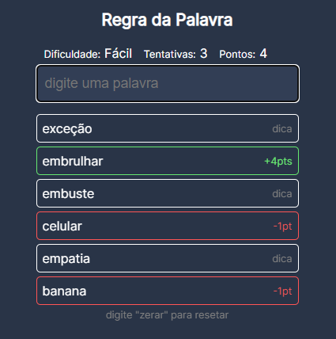

><a href="https://github.com/stars/VictorlBueno/lists/back-end" target="_blank">Ver mais repositórios como este</a> 
><a href="https://vlb-word-rule-game.netlify.app" target="_blank">Jogar pela web</a> (Only in Portuguese)

# Regra da Palavra 🔠

<h5>Como Jogar:</h5>
Descubra o que há em comum entre as palavras em verde e digite palavras com a mesma regra. 
<h5>Como vencer:</h5>
Para cada tentativa mais uma palavra de dica é mostrada. Descubra antes de 10 tentativas para vencer a rodada. 
<h5>Exemplos:</h5>
Pato, Palha, Polvo: Palavra iniciadas com P 
Tênis, Sair, Monitor: Palvras que contém I

# Linguagens 👨‍💻
<ul>
  <li>HTML</li>
  <li>CSS</li>
  <li>JavaScript</li>
</ul>
  
#
<h6>Redes Sociaiss&ensp;&ensp;&ensp;&ensp;
<a href="https://linkedin.com/in/victorlbueno/" target="_blank">LinkedIn</a>&ensp;&ensp;•&ensp;&ensp;
<a href="https://discordapp.com/users/Playsken#1180" target="_blank">Discord</a>&ensp;&ensp;•&ensp;&ensp;
<a href="https://www.hackerrank.com/Playsken" target="_blank">HackerRank</a>&ensp;&ensp;•&ensp;&ensp;
<a href="https://instagram.com/victorlbueno" target="_blank">Instagram</a></h6>
